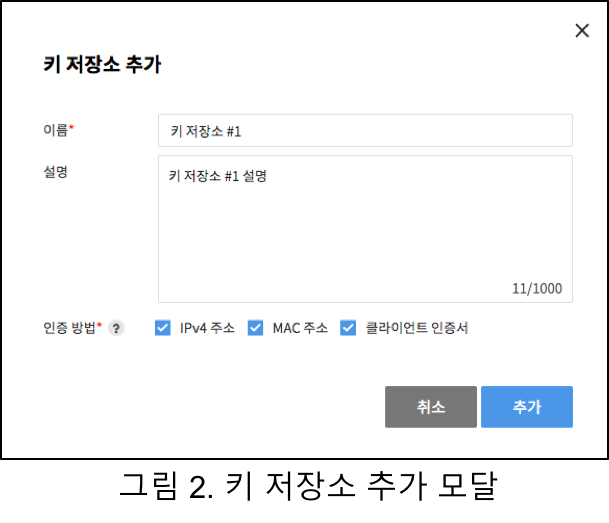
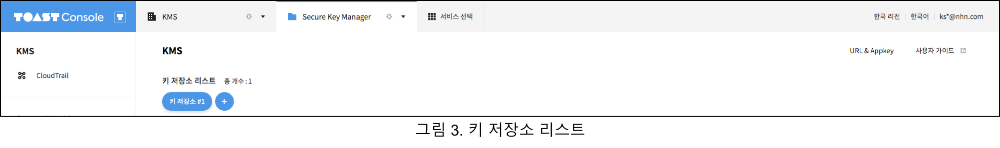
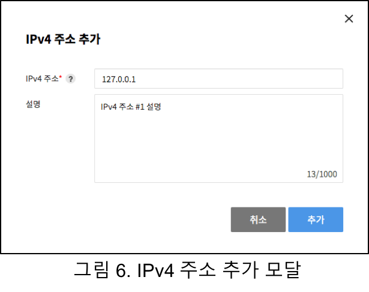
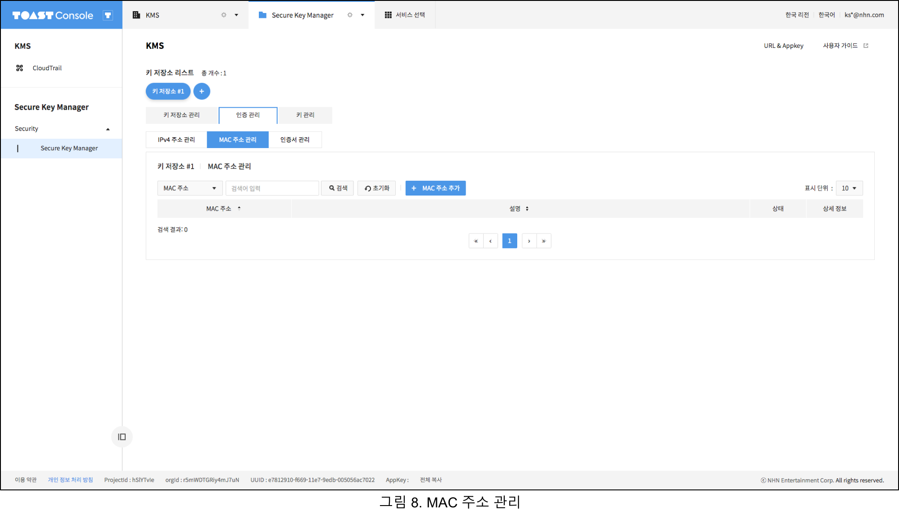
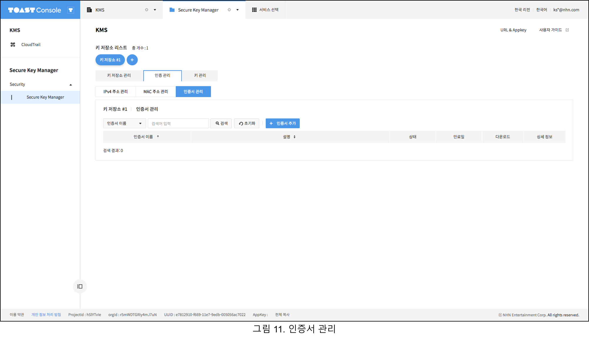
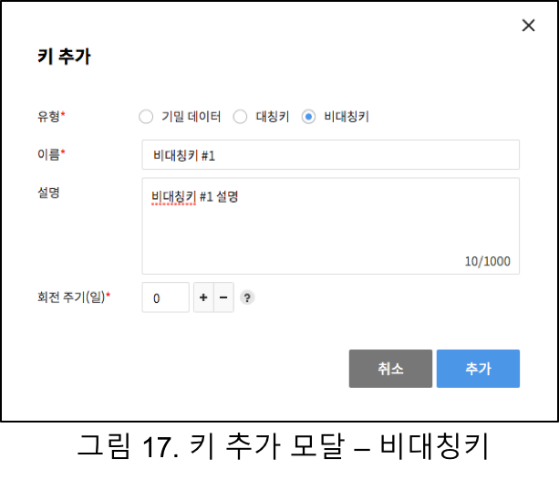

## Security > Secure Key Manager > 콘솔 사용 가이드

### Secure Key Manager 사용하기

사용자는 아래 단계를 수행해서 Secure Key Manager를 사용할 수 있습니다. 각 단계에 대한 설명은 개별 항목을 참고하시기 바랍니다.
1. 키 저장소 생성
2. 인증 정보 등록
3. 키 생성

#### 키 저장소 생성
Secure Key Manager는 키 저장소 단위로 인증 정보와 키를 관리합니다. Secure Key Manager를 처음으로 활성화하면 생성한 키 저장소가 없기 때문에 그림 1과 같은 화면을 표시합니다.

화면 중간의 [키 저장소 추가]를 클릭하면 그림 2와 같은 키 저장소 추가 모달을 실행합니다.

키 저장소 추가 모달에서 이름을 입력하고 한개 이상의 인증 방법을 선택합니다. [추가]를 클릭하면 키 저장소를 생성합니다. 키 저장소를 생성하면 그림3과 같이 키 저장소 리스트를 확인할 수 있습니다.

키 저장소 리스트의 +를 클릭하면 새로운 키 저장소를 생성할 수 있고, 이미 생성한 키 저장소 이름을 클릭하면 그림 4와 같이 키 저장소 정보를 확인할 수 있습니다.

#### 인증 정보 등록
Secure Key Manager는 IPv4 주소 인증, MAC 주소 인증, 클라이언트 인증서 인증을 제공합니다. 키 저장소에 설정한 인증 방법을 통과한 클라이언트만 키를 사용할 수 있습니다. 클라이언트를 인증하려면 인증 관리 메뉴의 인증 유형별 하위 메뉴에서 인증 정보를 등록해야 합니다.

##### IPv4 주소 등록
IPv4 주소 관리 메뉴를 선택하면 그림 5와 같은 IPv4 주소 관리 화면을 표시합니다.

[IPv4 주소 추가]를 클릭하면 그림 6과 같이 IPv4 주소 추가 모달을 실행합니다.

API 호출을 허용할 클라이언트의 IPv4 주소를 입력한 후 [추가]를 클릭해서 IPv4 주소 인증 정보를 추가합니다. 추가한 인증 정보는 그림 7과 같이 IPv4 주소 관리 화면에서 확인할 수 있습니다.

##### MAC 주소 등록
MAC 주소 관리 메뉴를 선택하면 그림 8과 같은 MAC 주소 관리 화면을 표시합니다.

[MAC 주소 추가]를 클릭하면 그림 9과 같이 MAC 주소 추가 모달을 실행합니다.

API 호출을 허용할 클라이언트의 MAC 주소를 입력한 후 [추가]를 클릭해서 MAC 주소 인증 정보를 추가합니다. 추가한 인증 정보는 그림 10과 같이 MAC 주소 관리 화면에서 확인할 수 있습니다.

##### 클라이언트 인증서 등록
인증서 관리 메뉴를 선택하면 그림 11과 같은 인증서 관리 화면을 표시합니다.

[인증서 추가]를 클릭하면 그림 12와 같이 인증서 추가 모달을 실행합니다.

인증서 이름, 비밀번호, 사용 기간을 입력한 후 [추가]를 클릭해서 클라이언트 인증서를 생성할 수 있습니다. 추가한 인증 정보는 그림 13과 같이 인증서 관리 화면에서 확인할 수 있습니다. 

인증서 관리 화면에서 다운로드 아이콘을 클릭하면 인증서 파일를 다운로드 받을 수 있습니다. 인증서는 키 저장소당 최대 3개 까지만 생성할 수 있습니다.

#### 키 생성
Secure Key Manager는 3가지 유형의 키를 지원합니다. 기밀 데이터는 텍스트 형태의 모든 데이터를 관리합니다. 대칭키는 API를 사용한 암/복호화를 제공합니다. 비대칭키는 API를 사용한 서명/검증 기능을 제공합니다. 키 관리 메뉴를 선택하면 14와 같은 키 관리 화면을 표시합니다. 키 관리 화면에서 [키 추가]를 클릭하면 키 추가 모달을 실행할 수 있습니다.

##### 기밀 데이터
키 추가 모달에서 유형을 기밀 데이터를 선택하면 그림 15와 같은 화면을 표시합니다.

키 이름과 텍스트 형태의 데이터를 입력한 후 [추가]를 클릭해서 기밀 데이터를 등록할 수 있습니다.

##### 대칭키

키 추가 모달에서 유형을 대칭키를 선택하면 그림 16과 같은 화면을 표시합니다.

키 이름과 회전 주기를 입력한 후 [추가]를 클릭해서 대칭키를 등록할 수 있습니다.

##### 비대칭키

키 추가 모달에서 유형을 대칭키를 선택하면 그림 17과 같은 화면을 표시합니다.

키 이름과 회전 주기를 입력한 후 [추가]를 클릭해서 비대칭키를 등록할 수 있습니다.

키 추가 모달에서 추가한 키를 그림 18과 같이 키 관리 화면에서 확인할 수 있습니다.

